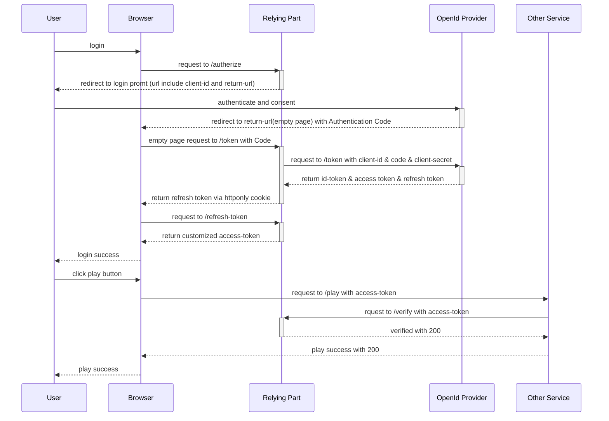
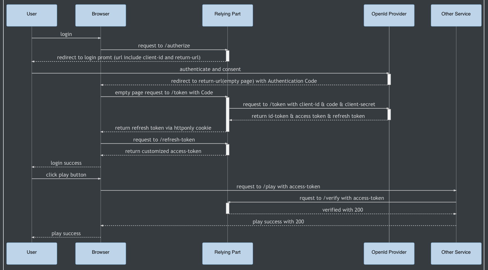

# SSO

### SSO with Authentication Code



Add picture as the github markdown can't display mermaid correctly



### Referance

- https://hasura.io/blog/best-practices-of-using-jwt-with-graphql/

- [OAuth 2.0](https://auth0.com/docs/flows/authorization-code-flow)


### SSO with Saml


#### Simulate login


- CORS(Cross-Origin Resource Sharing)
  - Same Origin Policy
  - Trigger conditions
    - Different domains, e.g.: http://example.com —> http://api.com
    - Different sub domains, e.g.: http://a.example.com —> http://b.example.com 
    - Different ports, e.g.: http://localhost:3000 —> http://localhost:8000
    - Different potocols: e.g.: https://exmple.com —> http://exmple.com
  - The affected resources
    - Cookie, LocalStorage, IndexDB
    - DOM
    - AJAX
  - Solution
    - Allow CORS — White List
      - preflight request — OPTIONS
      - position — backend / proxy

    - Proxy — Nginx/ALB
      - Forward Proxy
      - Reverse Proxy
      - 

    - Form action - Using the form action will allow the CORS

      ```html
      <form 
            action="https://someurl/api/login" 
            method="post" 
            encType="application/x-www-form-urlencoded"
      >
      	<input type="text" name="request-key" value="request-value"/>
        <button type="submit">submit</button>
      </form>
      ```

