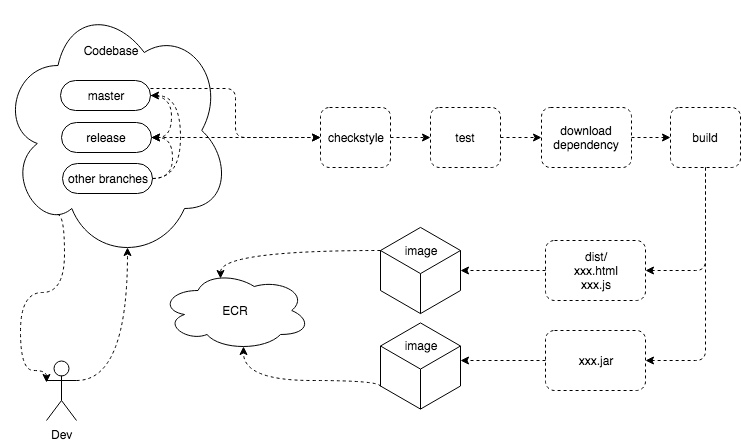
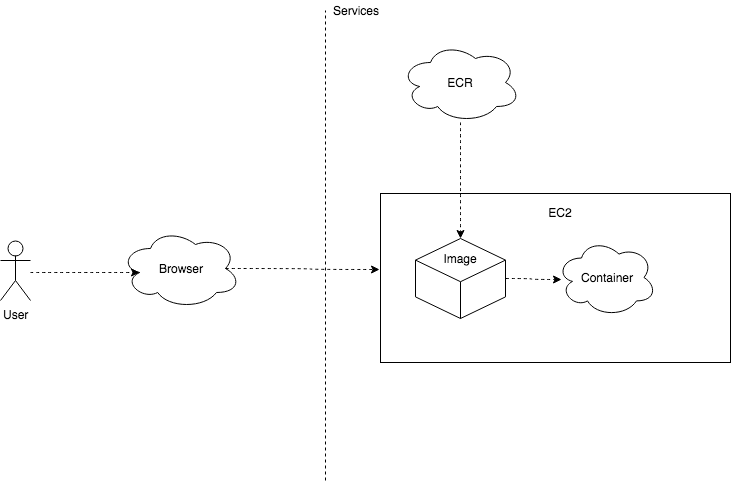
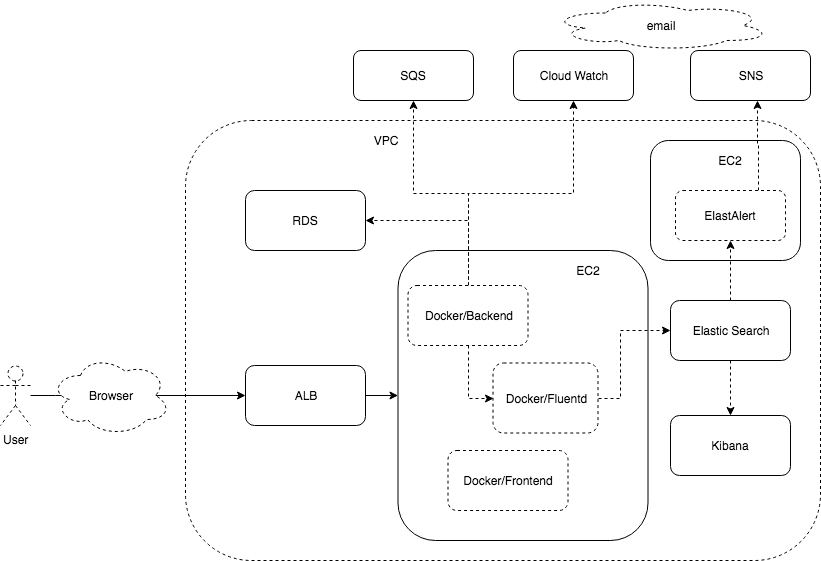

## What is Devops?

- Automation

- Sharing

- Feedback

- Continuous intergration, Continuous devlivery

  

## Devops In PSIM

### CI

### CD

#### Environment

- Dev — Master — developement 
- QA — Master — development
- UAT — Master / Release — production — SSO in Test Env
- Dryrun — Release — development
- Production — Release — production — SSO in Production Env

### Architecture

### Skills

- CI / CD
  - Git
  - Pipeline as Code
    - Jenkins
- Infrustructure as Code
  - Ansible
  - Terraform
    - ALB
    - EC2
    - Cloud Watch - Monitoring
    - EFK - Logs & Monitoring
      - Elastic Search
      - Fluentd
      - Kibana
    - ElastAlert - Alerting
    - SQS
    - SNS
    - RDS
- Containerization
  - Docker
