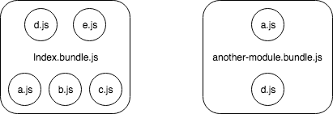

### Package Management Tools

##### NPM (Node Package Management)

- nvm

- command

  ```shell
  npm install
  npm uninstall
  npm update
  npm ls
  npm search
  npm config list
  npm config get registry
  npm config set registry https://registry.npm.taobao.org
  npm config get userconfig
  npm config get globalconfig
  npm root
  npm root -g
  ```

- package.json

  - dependencies

    ```shell
    npm i --only=prod
    ```

  - devDependencies

    ```shell
    npm i --only=dev
    ```

  - peerDependencies / bundleDependencies / optionalDependencies

  - version

    -  `react: 16.6.3`
      - `16`: the main version
      - `6`: the sub version
      - `3`: the patch version
    - version limitation
      - `^16.6.3`: using the latest `16.x.x` version
      - `~16.6.3`: using the latest `16.6.x` version
      - `16.6.6`: using the specific `16.6.6` version
      - `latest`: using the latest version

  - engines

    ```json
    {
      "engines": {
        "node": "8.14.0"
        "npm": "~6.8.0"
      }
    }
    ```

  - private

  - publishConfig

##### Yarn

### Bundle Tools

##### Gulp / Grunt / Browserify

##### Webpack

- Entry
- Output
- Loaders
  - babel - babel is a javascript compiler - ECMAScript
- Plugins
  - uglifyjs-webpack-plugin
  - html-webpack-plugin
  - git-revision-webpack-plugin
  - CommonsChunkPlugin / DllPlugin / SplitChunksPlugin 
  - webpack-bundle-analyzer


- `compile` 开始编译
- `make` 从入口点分析模块及其依赖的模块，创建这些模块对象
- `build-module` 构建模块
- `after-compile` 完成构建
- `seal` 封装构建结果
- `emit` 把各个chunk输出到结果文件
- `after-emit` 完成输出

##### Code Splitting

- Entry Points: Manually split code using `entry` configuration

  ```js
  module.exports = {
    entry: {
      index: './src/index.js',
      another: './src/another-module.js'
    },
    output: {
      filename: '[name].bundle.js',
      path: path.resolve(__dirname, 'dist')
    }
  }
  ```

  —> `index.bundle.js` , `another.bundle.js`

  

- Prevent Duplication: Using the `SplitChunksPlugin` to deduce and split chunks

  ```js
  module.exports = {
    entry: {
      index: './src/index.js',
      another: './src/another-module.js'
    },
    output: {
      filename: '[name].bundle.js',
      path: path.resolve(__dirname, 'dist')
    }
    optimization: {
      splitChunks: {
        chunks: "all"
      }
    }
  }
  ```

  —> `index.bundle.js`, `another.bundle.js` 

  —> `vendors~index.bundle.js`, `vendors~another~index.bundle.js`

  

  - bundle vendors to one file

    ```js
    module.exports = {
      optimization: {
        splitChunks: {
          cacheGroups: {
            vendors: {
              test: /[\\/]node_modules[\\/]/,
              name: 'vendors',
              enforce: true,
              chunks: 'all'
            }
          }
        }
      }
    }
    ```

    —> index.bundle.js

    —> vendors.bundle.js

- Dynamic Imports: Split code via inline function calls within modules

  ```js
  module.exports = {
  	entry: './src/index.js',
    output: {
      filename: '[name].bundle.js',
      chunkFilename: '[name].bundle.js',
      path: path.resolve(__dirname, 'dist')
    }
  }
  ```

  ###### Js

  Using to replace:

  ```js
  const Foo = import('./Foo')
  ```

  ```js
  import Foo from './Foo'
  ```

  Support dynamic import:

  ```shell
  npm i --save-dev @babel/plugin-syntax-dynamic-import
  ```

  ```js
  {
    plugins: [
      '@babel/plugin-syntax-dynamic-import'
    ]
  }
  ```

  

### References

- [前端打包利器webpack](https://juejin.im/post/5c8d172ce51d4548dc2333d0)
- [dependencies or devDependencies?](https://silvenon.com/blog/dependencies-or-devdependencies)
- [npm-package.json](https://docs.npmjs.com/files/package.json#dependencies)
- [code-splitting](https://webpack.js.org/guides/code-splitting/#bundle-analysis)
  - [split-chunks-plugin](https://webpack.js.org/plugins/split-chunks-plugin/)
  - [Dynamic imports, React and Redux](https://codeburst.io/dynamic-imports-react-and-redux-29f6d2d88d77)
- [AST](https://segmentfault.com/a/1190000016231512)
- [AST in JS](https://juejin.im/post/5c2714fb51882575f560503c)
- [webpack4.x性能优化](https://juejin.im/post/5c5a3a64f265da2d8532b606)
- [React 16加载性能优化指南](https://juejin.im/post/5b506ae0e51d45191a0d4ec9)

### Questions

- Why npm is node package management ?
- ~~Why webpack compile js/css to AST, and traversal the AST to a new js ?~~

