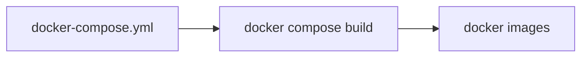

# Docker
C/S架构，客户端向服务器发送请求，服务器负责构建、运行和分发容器。
## 虚拟机 vs 容器
- 虚拟机
    - 复杂
    - 耗时
    - 贵
- 容器
    - 所有容器共享内核
    - 同一个内核提供了容器隔离，替代了传统虚拟机的管理程序
## 核心组件
    - Client 客户端
    - Docker daemon 服务器
        - 服务器组件，以Linux后台服务方式运行
        - 负责创建、运行、监控容器、构建、存储镜像
        - 默认配置只能响应本地Host的客户端请求
    - Image 镜像
    - Registry 仓库
    - Container 容器

## Contents
### Hooking your source code into a container
#### How to get source code into a container
1. Create a container volume that points to the source code.
#### Layered filesystem
- Image layers(readonly)
- Container layers(read/write)
- Volume
    - create a volume
        - `docker run -p 8080:3000 -v /var/www node`
            - `-v` create a volume
            - `/var/www` container volume
        - `docker run -p 8080:3000 -v $(pwd):/var/www node`
            - `$(pwd)` host location
        - `docker run -p 8080:3000 -v $(pwd):/var/www -w "/var/www" node npm start`
            - `-w "/var/www"` 指定command的工作目录
    - locating a volume, take a look at `Mounts` property.
        - `docker inspect containerId`
    - remove the container with volume
        - `docker rm -v lastContainerId`

- Volume可以使用以下两种方式创建：
    - 在Dockerfile中指定VOLUME /some/dir
    - 执行docker run -v /some/dir命令来指定

1. Add your source code into a custom image that is used to create a container.
### Dockerfile
- Key instructions
    - FROM
    - MAINTAINER
    - RUN
    - COPY
    - ENTRYPOINT
    - WORKDIR
    - EXPOSE
    - ENV
    - VOLUME
- Example
  ```Dockerfile
  FROM node
  MAINTAINER Shane
  COPY . /var/www
  WORKDIR /var/www
  RUN npm install
  EXPOSE 8080
  ENTRYPOINT ["node", "server.js"]
  ```
- Build image
    - `docker build -f Dockerfile -t shane/node .`
        - `-f` assign using which dockerfile to build
        - `-t` tag the build
        - `.` build context
    - `docker images`
    - `docker run -d -p 8080:3000 shane/node`
        - `-d` backend
        - `-p` port mapping
    - `docker ps -a`
    - `docker rm containerId`
        - `docker rm -f $(docker ps -a -q)`
            - `-a`: show all
            - `-q`: only display numeric IDs
    - `docker rmi imageId`
    - `docker push shane/node`, publishing an image to Docker Hub
        - go to hub.docker.com to registry
    - `docker pull shane/node`, download docker image

### Communicate between docker container
- Option 1 //start mongodb and node(link node to mongodb container with legacy links)
    - Run a container with name
        - `docker run -d --name my-postgres postgres`
            - `--name` define a name for container
    - Link to running container by name
        - `docker run -d -p 5000:5000 --link my-postgres:postgres shane/node`
            - `--link` link to named container
            - `my-postgres` name of linked container
            - `postgres` linked container alias
    - We can use the alias name `postgres` in `shane/node`
        ```json
        {
            "databaseConfig": {
                "host": "postgres",
                "database": "funWithDocker"
            }
        }
        ```
- Option 2 //Create a custom bridge network and add containers into it
    - Container network
        - `docker network create --driver bridge isolated_network`: create a custom container network
            - `create`: create a custom network
            - `bridge`: use a bridge network
            - `isolated_network`: name of the custom network
        - `docker run -d --net=isolated_network --name mongodb mongo`: run containers in the network
            - `--net`: run container in network
            - `--name mongodb`: "Link" to this container by name
        - commands
            - `docker network ls`
            - `docker network inspect isolated_network`: 查看这个network bridge下关联了哪些container
- Running command inside container.
  
    - `docker exec containerId node dbSeeder.js`

### Docker Compose

```yml
version: '2'

services:
  node:
    build:
      context: .
      dockerfile: Dockerfile
    ports:
      - "8081:3000"
    networks:
      - nodeapp-network
  mongodb:
    image: mongo
    networks:
      - nodeapp-network
  postgres:
  	image: postgres
    environment:
      - POSTGRES_USER=postgres
      - POSTGRES_PASSWORD=postgres
      - POSTGRES_DB=postgres-db
    ports:
      - 5431:5432
    container_name: postgres

networks:
  nodeapp-network:
    driver: bridge
```
- Key service configuration options
    - build
    - environment
    - image
    - networks
    - ports
    - volumes
    
- Key docker compose commands
    - `docker-compose build`
        - build or rebuild services defined in docker-compose.yml
        - `docker-compose build mongo`
            - only rebuild one of the services 
    - `docker-compose up -d`
        - create and start the containers
        - `-d`: running in backend
        - `docker compose up --no-deps node`
            - `--no-deps`: do not recreate services that node depends on
            - `node`: rebuild node image and stop,destroy and recreate only node
    - `docker-compose down`
        - take all the containers down(stop and remove)
        - `docker-compose down --rmi all --volumes`
            - `--rmi all`: remove all images
            - `--volumes`: remove all volumes
    - `docker-compose logs`
    - `docker-compose ps`
    - `docker-compose stop`
    - `docker-compose start`
    - `docker-compose rm`
    - `docker-compose exec <service-name> sh -c "<command>"`: 进入service执行命令
### [Docker Cloud](https://cloud.docker.com/)
- Link to Different Cloud Providers
- Setup and provision nodes
- Create a stack of Docker services to deploy in the cloud
    - stackfile
- Manage stacks and services
## CMD
- docker build [options] build

- docker-machine 
    - 用于帮助我们在远程的机器上安装Docker，或者虚拟机host上直接安装虚拟机并在虚拟机里装docker
    - 还可以用来管理这些虚拟机和Docker

### Docker clean spaces

- docker stop $(docker ps -a -q)

- docker rm $(docker ps -a -q)

- docker rmi $(docker images -q)

- docker rmi -f $(docker images -q)

