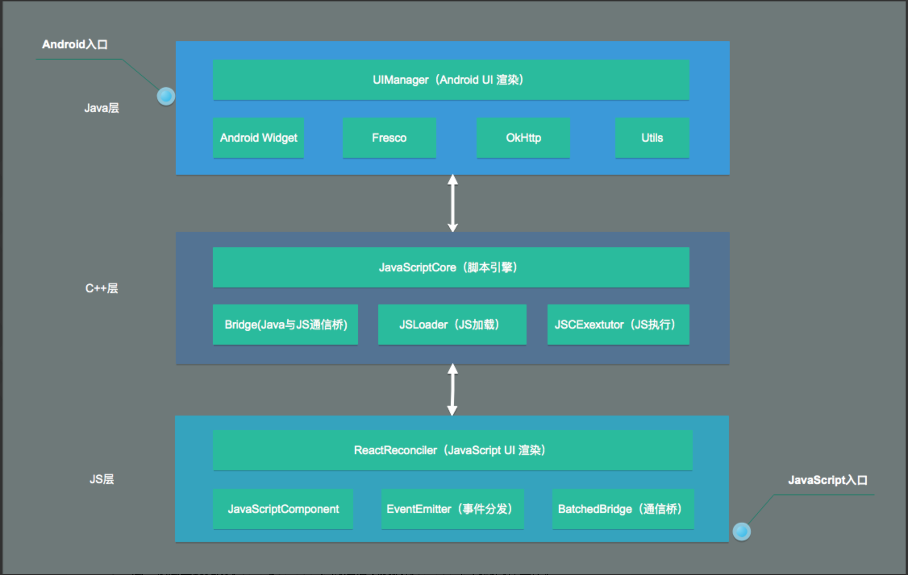

# Native

## React Native

#### Basic

- Platform specific code
  - Platform module
    - `Platform.OS`, `Platform.select()`, `Platform.Version` ...
  - Platform-specific extensions
    - `.ios.` or `.android.`
    - `.native.` : a module needs to be shared between NodeJS/Web and React Native but it has no Android/iOS differences
- Navigation
  - [React Navigation](https://reactnavigation.org/docs/en/getting-started.html)
    - [navigation-lifecycle](https://reactnavigation.org/docs/en/navigation-lifecycle.html)
  - react-native-navigation

#### Communicate with Native

Run time: React Native => Js Core (Js VM) => Bridge (JSON) => iOS / Android

	- iOS: javascript core
	- webkit.org官方开源的jsc.so

Debug(Chrome V8): React Native => WebSocket => iOS / Android



##### Reference

- [React Native运行原理](https://cloud.tencent.com/developer/article/1036325)
- [React Native for Android 原理分析与实践：实现原理](https://juejin.im/post/5a6460f8f265da3e4f0a446d)

#### Communicate with Other Components

- AsyncStorage / JSON
- EventEmitter / EventTarget / EventDispatcher 继承或实现接口
- Signals 模式
- Publish / Subscribe 广播

#### [Communicate between Native and React Native](https://facebook.github.io/react-native/docs/communication-ios)

#### Native Modules

- [iOS](https://facebook.github.io/react-native/docs/native-modules-ios)
  - Object-C
    - Native to ReactNative modules
      - `RCTBridgeModule ` protocol
      - `RCT_EXPORT_METHOD()`
        - `NSString`
        - `NSIntegar, float, double, CGFloat, NSNumber`
        - `BOOL, NSNumber` 
        - `NSArray` - array
        - `NSDictionary - object`
        - `RCTResponseSenderBlock` - function - Js to Native
          - async/await - `RCTPromiseResolveBlock` and `RCTPromiseRejectBlock`
        - `RCTConvert`
    - Threading
      - `(dispatch_queue_t)methodQueue` : specify which queue the method should be run on
        - `dispatch_get_main_queue()`
        - `RCTAsyncLocalStorage` : create own queue for communication
          - `dispatch_queue_create()`
          - `dispatch_async()`
    - Sending events to Js - Native to Js
      - subclass `RCTEventEmitter`, implement `supportedEvents` and call `self sendEventWithName`
    - [Implement Native UI Components](https://facebook.github.io/react-native/docs/native-components-ios)
      - Subclass `RCTViewManager`
      - `RCT_EXPORT_METHOD()` / `RCT_EXPORT_VIEW_PROPERTY`
      - Implement `-(UIView *) view`
      - `RCTRootView` : a `UIView` that holds a React Native app

- [Andriod](https://facebook.github.io/react-native/docs/native-modules-android)
  - Java
    - Native to ReactNative modules
      - `ReactContextBaseJavaModule` / `ReactApplicationContext`
      - `@ReactMethod` / `getReactApplicationContext()` : to expose a method to JavaScript a Java method
        - Boolean
        - Integer
        - Double
        - Float
        - String
        - Callback
        - ReadableMap
        - ReadableArray
      - implement `ReactPackage`, override `createNativeModules` method
      - provide `getPackages` inside `MainApplication.java`
    - Sending Events to JavaScript
      - get `RCTDeviceEventEmitter` from `ReactContext`
      - 

#### Advanced

	- animations
	- maps
	- notifications
	- navigation


#### React Native Debugger

- `brew update` & `brew cask install react-native-debugger`

- `open "rndebugger://set-debugger-loc?host=localhost&port=8081"`

- [Reacttron]()

  - debuging native network

- iOS:

   - `command + r`: reload
   - `command + d`: open developer menu

 -  Android:

     -  `r+r`: reload

     -  `command + m`: open developer menu

     -  `adb devices` : show emulator list
     
     -  `adb -s emulator-5554 emu kill`  : kill emulator
     
        

#### Related Libraries

- `@react-native-community/netinfo` :  React Native Network Info API for Android, iOS & Windows

- [react-native-navigation v1](https://x-guard.github.io/react-native-navigation/#/)

- [react-native-firebase](https://rnfirebase.io/docs/v5.x.x/getting-started)

- [react-native-webview](https://www.npmjs.com/package/react-native-webview)

- react-native-secure-key-store

## IOS

 - xcode
 - `react-native run-ios "reset-cache"` : reset cache
 - `open -a Simulator`

## Android

 - andriod studio
    - `brew cask install android-platform-tools`
    - `adb devices`
 - android-sdk
 - java-sdk
    - `which java`, `java -vesion`
    - list installed java version
       - `/usr/libexec/java_home -V` 
    - switch java version
       - `export JAVA_HOME=$(/usr/libexec/java_home -v 11)`
       - `export JAVA_HOME=$(/usr/libexec/java_home -v 1.8)`
 - allow licenses
    - switch to Java 1.8
    - `cd ~/Library/Android/sdk/tools/bin` && `./sdkmanager --licenses`

### Build / Deploy

- Build
  - `fastlane android build env:dev`
  - `fastlane ios build env:dev`
- Deploy
  - `fastlane android deploy_to_fabric env:dev crashlytics_groups:mol-devs-1,mol-test-devices`
  - `fastlane ios deploy_to_fabric crashlytics_groups:mol-devs-1,mol-test-devices`

### Tools

- [Ruby Gem](https://rubygems.org/)

  - RubyGems is a package management framework for Ruby.

- [CocoaPods](https://guides.cocoapods.org/)

  - a dependency manager for Swift and Objective-C Cocoa projects.

  - `pod install` to install the dependencies inside `Podfile`  but out of `Podfile.lock`.

    

- [Fastlane](https://docs.fastlane.tools/codesigning/getting-started/)

  - The easiest way to build and release mobile apps. fastlane handles tedious tasks so you don’t have to.
  - generate the fastlane session
    - ```fastlane spaceauth -u [email]```  

- [Firebase](https://firebase.google.com/docs)

  - [Fabric](https://get.fabric.io/): will be replace by firebase

  

### Reference

- [Fastlane — Simple React Native iOS Releases](https://shift.infinite.red/simple-react-native-ios-releases-4c28bb53a97b)
- [awesome-react-native](https://github.com/jondot/awesome-react-native)
- [React Native 跨平台移动应用开发](https://item.jd.com/12181462.html)
- [React Native 移动开发实战](https://item.jd.com/12134609.html)

#### Plan to know

- Navigator
- How does the React Native call the Native api?
- Mock Framework
- Message Queue
- Build Bundles with different Apps together

