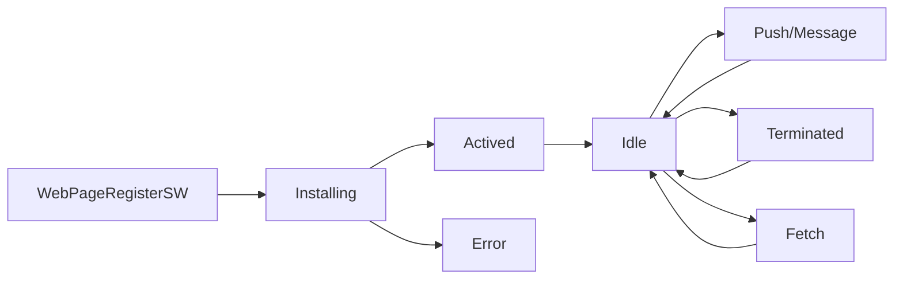
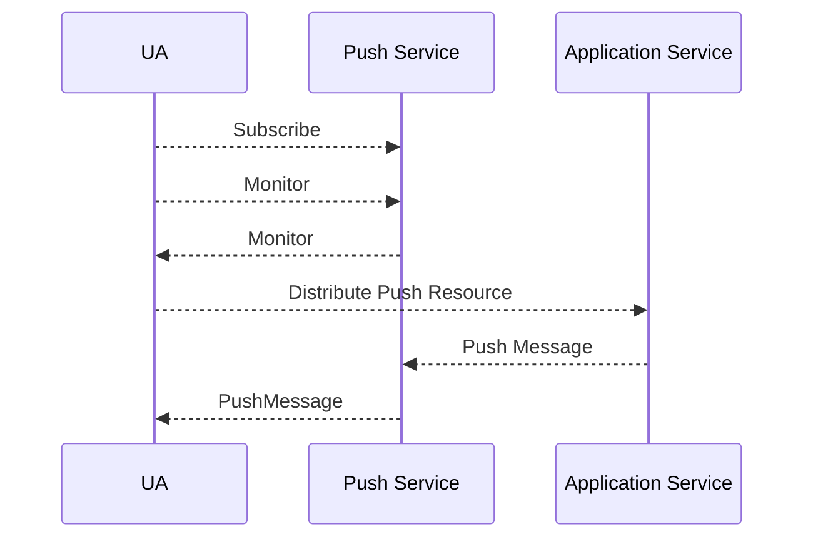

# Progressive Web App
## Concepts
### App shell
- The app "shell" is the minimal HTML, CSS and JavaScript required to power the user interface and when cached offline can ensure instant, reliably good performance to users on repeat visits.
- This means the application shell is not loaded from the network every time the user visits. Only the necessary content is needed from the network.

### Storage
#### Local Storage
- Easy to use key/value
- Can only store strings
- Synchronous

#### Cache
- Easy to use
- Asyncronous
- FAST

#### IndexDB
- FAST
- Complex data
- Asyncronous
- Transactional

### Service Worker
A service worker is a javascript file that is run by your browser in the background, separate from your webpage.

#### Flow Chart


#### Service Worker Scope
```js
if ('serviceWorker' in navigator) {
    navigator.serviceWorker
        .register('/sw.js')
        .then(() => something);
}
```

- /sw.js means the service worker will fetch event for the entire origin
- /folder/sw.js means the service worker only fetch event for the page who's URL start with /folder/something

#### Caching the app shell
```js
if ('caches' in window) {} //support caches
```

```js
self.addEventListener('install', function(e) => {
    console.log('[SeviceWorker] Install');
    e.waitUntil(
        caches.open(cacheName).then(function(cache) {
            console.log('[SeviceWorker] Caching app shell');
            return caches.addAll(filesToCache);
        })
    );
});

self.addEventListener('activate', function(e) {
    console.log('[ServiceWorker] Activate');
    e.waitUntil(
        caches.keys().then(function(keyList) {
            return Promise.all(keyList.map(function(key) {
                if (key !== cacheName) {
                    console.log('[ServiceWorker] Removing old cache', key);
                    return caches.delete(key);
                }
            }))
        })
    );
});

self.addEventListener('fetch', function(e) {
    console.log('[ServiceWorker] Fetch', e.request.url);
    e.respondWith(
        caches.match(e.request).then(function(response) {
            return response || fetch(e.request);
        });
    );
});
```

##### Caching Strategies
- Cache First, then Network 
    - for storing commonly used resources, eg: key components of the app shell
- Network First, then cache 
    - for content that is updated frequently not part of the app shell
- Cache only
    - for when you need to guarantee that no network request will be made, eg: saving battery on mobile devices
- Network only
    - for things that don't have an offline equivalent, eg: analytics pings, non-get requests
- Cache ane Network Race
    - request the resource from both the cache and the network in parallel
    - when the network request completes the cache is updated, so the future cache reads will always be more up to date.
- Cache Then Network
    - for data that is updated frequently or it's important to get data on-screen as quickly as posible
    - show cache data first, then update the cache and the page when network data arrives

##### Using Service Worker Precache
- gulp or grunt
- SW-precache
    - use the runtime caching option to cache the app data
- [generate service worker](./progressive-web-app/ud811/3-12/gulpfile.js)

### SSE - Server Sent Events
  

#### Client

```js
if ('EventSource' in window) {
    const source = new EventSource(url, {withCredentials: true}); //withCredentials use to toggle whether need to send cookie or not
    /*
        0: EventSource.CONNECTING
        1: EventSource.OPEN
        2: EventSource.CLOSED
    */
   source.onopen = function(event) {};
   source.addEventListener('open', function(event) {}, false);

   source.onmessage = function(event) {
       const data = event.data;
   };
   source.addEventListener('message', function(event) {
       const data = event.data;
   }, false);

   source.onerror = function(event) {};
   source.addEventListener('error', function(event) {}, false);

   source.close();
}
```
#### Server
- header
```
Content-Type: text/event-stream
Cache-Control: no-cache
Connection: keep-alive
```
- message
    - field can be `data`, `event`, `id`, `retry`
```
[field]: value\n
```
eg:
```
: this is a comment
id: msg1\n
data: {\n
data: "foo": "bar",\n
data: "baz", 500\n
data: }\n\n
retry: 10000\n
```

Node example:
```js
const http = require("http");

http.createServer(function (req, res) {
  const fileName = "." + req.url;

  if (fileName === "./stream") {
    res.writeHead(200, {
      "Content-Type":"text/event-stream",
      "Cache-Control":"no-cache",
      "Connection":"keep-alive",
      "Access-Control-Allow-Origin": '*',
    });
    res.write("retry: 10000\n");
    res.write("event: connecttime\n");
    res.write("data: " + (new Date()) + "\n\n");
    res.write("data: " + (new Date()) + "\n\n");

    interval = setInterval(function () {
      res.write("data: " + (new Date()) + "\n\n");
    }, 1000);

    req.connection.addListener("close", function () {
      clearInterval(interval);
    }, false);
  }
}).listen(8844, "127.0.0.1");
```

### Push API

#### Workflow
1. Subscribe
    1. Ask Permission
    2. Subscribe - browser subscribe to Push Service, then got `PushSubscription`
    3. Monitor - generate subscription information to contact with Client
    4. Distribute Push Service - Send `PushSubscription` to Application Service to save
2. Push Message
    1. Application Service push message to Push Service
    2. Push Service get the message and verify it and then push to Client who subscribe it
    3. Client get message

#### Security
- `Client` got `Publish Key`, `Server` got `Private Key`
- `Client` will send `Publish Key` to Push Service when subscribing, and `Push Service` will maintain `Publish Key` & `endpoint`
- `Server` use the `Private Key` to sign the data and generate a `header` named `Authorization`
- `Push Service` use the `Publish Key` which got by `endpoint` to decode the digital signature

- web-push可以用于生成密钥
```js
const webPush = require('web-push');
const validKeys = webPush.generateVAPIDKeys();
console.log(validKeys.publicKey, validKeys.privateKey);
```

#### Example
- Web Push实现步骤
    - 浏览器发起订阅， 并将订阅信息发送至服务端
    - 将订阅信息保存在服务端，用于后续推送
    - 服务端推送消息，向Push Service发起请求
    - 浏览器接收Push信息并处理
- `userVisibleOnly` 
    - 表明该推送是否需要显性地展示给用户，即推送时是否会有消息提醒。如果没有消息提醒就表明是进行“静默”推送
    - 在Chrome中，必须要将其设置为true，否则浏览器就会在控制台报错
- `applicationServerKey` 
    - 是一个客户端的公钥, VAPID定义了其规范, 也可以称为VAPID keys, 该参数需要Unit8Array类型
    - urlBase64ToUint8Array方法将base64的公钥字符串转为Unit8Array

```js
function registerServiceWorker(fileName) {
    return navigator.serviceWorker.register(fileName);
}

function subscribeUserToPushService(registration, publishKey) {
    const subscribeOption = {
        userVisibleOnly: true,
        applicationServerKey: window.urlBase64ToUnit8Array(publishKey)
    }
    return registration.pushManager.subscribe(subscribeOption).then(function(pushSubscription) {
        console.log('Recieve PushSubscription:', JSON.stringify(pushSubscription));
        return pushSubscription;
    })
}

function sendSubscriptionToServer(body) {}
```

```js
if ('serviceWorker' in navigator && 'PushManager' in window) {
    const publicKey = 'BOEQSjdhorIf8M0XFNlwohK3sTzO9iJwvbYU-fuXRF0tvRpPPMGO6d_gJC_pUQwBT7wD8rKutpNTFHOHN3VqJ0A'; //???
    registerServiceWorker('./sw.js').then(function(registration) {
        console.log('register ServiceWorker successfully');
        return subscribeUserToPushService(registration, publishKey);
    }).then(function(subscription) {
        const body = {subscription, uniqueid: new Date().getTime()};
        return sendSubscriptionToServer(JSON.stringify(body));
    }).then(function (response) {
        console.log(response);
    }).catch(function (error) {
        console.log(error);
    });
}
```

// sw.js
```js
self.addEventListener('push', function(event) {
    if (!event.data) {
        console.log('Not data from push event');
        return;
    }
    const data = event.data.json();
    console.log('The data from push event:', data);
    self.registration.showNotification(data.text);
});
```

### Notification API

### Web App Manifest - [PWA]
- The web app manifest is a sample JSON file to control web app
```json
{
    name: "Weather",
    short_name: "Weather", //display on the screen, limit space
    start_url: "./index.html",
    icons: [{
        src: "/icons/icon-128.png",
        sizes: "128*128",
        type: "image/png"
    }, {
        src: "/icons/icon-144.png",
        sizes: "144*144",
        type: "image/png"
    }],
    background_color: "#2F3BA2",
    display: "standalone", //standalone will hide the address bar and the back/forward buttons
    orientation: "portrait"
}
```
- Icon sizes - make sure provide icons for 1x, 2x, 3x and 4x devices
    - 48px * 48px
    - 96px * 06px
    - 128px * 128px
    - 144px * 144px
    - 192px * 192px
    - 256px * 256px
    - 384px * 384px
    - 512px * 512px
- Let browser know we created a manifest file
```html
<link rel="manifest" href="manifest.json">
```
#### Deploy to an HTTPs host
- Github page
- Google app engine
- Firebase
    - redirect all requests to HTTPs
    - [firebase cli tool](https://github.com/firebase/firebase-tools)
        - `npm i -g firebase-tools`
        - commands
            - firebase login
            - firebase init
            - firebase deploy


## Resources
- [Web Page Test](https://www.webpagetest.org/)
- Storage
    - [localForage - Offline storage, improved. Wraps IndexedDB, WebSQL, or localStorage using a simple but powerful API](https://localforage.github.io/localForage/)
    - [store2 -  A better way to use localStorage and sessionStorage](https://github.com/nbubna/store)
    - [lovefield - a relational database for web apps](https://github.com/google/lovefield)
- Service Worker
    - [tool - show all the installed service workers, their state, update, get rid of them](chrome://serviceworker-internals/)
- SSE
    - [Server-Sent Events 教程 -- 阮一峰](http://www.ruanyifeng.com/blog/2017/05/server-sent_events.html)
- Push
    - [使用Push API实现消息推送](https://www.jianshu.com/p/9970a9340a2d)
- PWA
    - [Web Manifest Validator](https://manifest-validator.appspot.com/)
    - [example](https://codelabs.developers.google.com/codelabs/your-first-pwapp/)