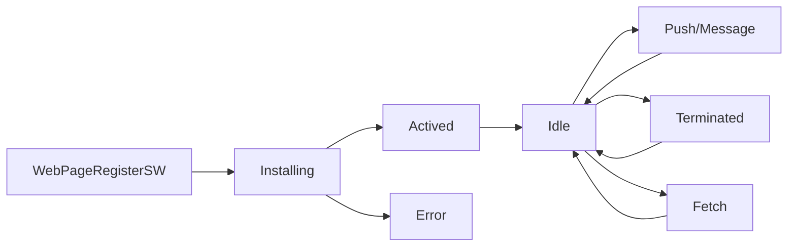

# Progressive Web App
## Concepts
### App shell
- The app "shell" is the minimal HTML, CSS and JavaScript required to power the user interface and when cached offline can ensure instant, reliably good performance to users on repeat visits.
- This means the application shell is not loaded from the network every time the user visits. Only the necessary content is needed from the network.

### Storage
#### Local Storage
- Easy to use key/value
- Can only store strings
- Synchronous

#### Cache
- Easy to use
- Asyncronous
- FAST

#### IndexDB
- FAST
- Complex data
- Asyncronous
- Transactional

### Service Worker
A service worker is a javascript file that is run by your browser in the background, separate from your webpage.

#### Flow Chart


#### Service Worker Scope
```js
if ('serviceWorker' in navigator) {
    navigator.serviceWorker
        .register('/sw.js')
        .then(() => something);
}
```

- /sw.js means the service worker will fetch event for the entire origin
- /folder/sw.js means the service worker only fetch event for the page who's URL start with /folder/something

#### Caching the app shell
```js
if ('caches' in window) {} //support caches
```

```js
self.addEventListener('install', function(e) => {
    console.log('[SeviceWorker] Install');
    e.waitUntil(
        caches.open(cacheName).then(function(cache) {
            console.log('[SeviceWorker] Caching app shell');
            return caches.addAll(filesToCache);
        })
    );
});

self.addEventListener('activate', function(e) {
    console.log('[ServiceWorker] Activate');
    e.waitUntil(
        caches.keys().then(function(keyList) {
            return Promise.all(keyList.map(function(key) {
                if (key !== cacheName) {
                    console.log('[ServiceWorker] Removing old cache', key);
                    return caches.delete(key);
                }
            }))
        })
    );
});

self.addEventListener('fetch', function(e) {
    console.log('[ServiceWorker] Fetch', e.request.url);
    e.respondWith(
        caches.match(e.request).then(function(response) {
            return response || fetch(e.request);
        });
    );
});
```

##### Caching Strategies
- Cache First, then Network 
    - for storing commonly used resources, eg: key components of the app shell
- Network First, then cache 
    - for content that is updated frequently not part of the app shell
- Cache only
    - for when you need to guarantee that no network request will be made, eg: saving battery on mobile devices
- Network only
    - for things that don't have an offline equivalent, eg: analytics pings, non-get requests
- Cache ane Network Race
    - request the resource from both the cache and the network in parallel
    - when the network request completes the cache is updated, so the future cache reads will always be more up to date.
- Cache Then Network
    - for data that is updated frequently or it's important to get data on-screen as quickly as posible
    - show cache data first, then update the cache and the page when network data arrives

##### Using Service Worker Precache
- gulp or grunt
- SW-precache
    - use the runtime caching option to cache the app data
- [generate service worker](./progressive-web-app/ud811/3-12/gulpfile.js)

## Resources
- [Web Page Test](https://www.webpagetest.org/)
- Storage
    - [localForage - Offline storage, improved. Wraps IndexedDB, WebSQL, or localStorage using a simple but powerful API](https://localforage.github.io/localForage/)
    - [store2 -  A better way to use localStorage and sessionStorage](https://github.com/nbubna/store)
    - [lovefield - a relational database for web apps](https://github.com/google/lovefield)
- Service Worker
    - [tool - show all the installed service workers, their state, update, get rid of them](chrome://serviceworker-internals/)