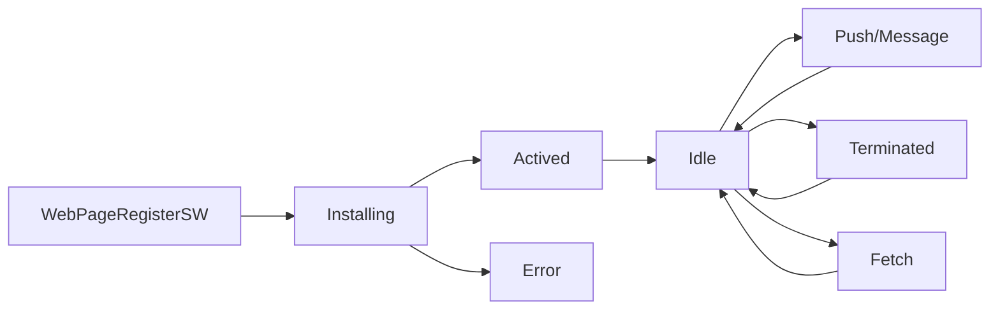

# Progressive Web App
## Concepts
### App shell
- The app "shell" is the minimal HTML, CSS and JavaScript required to power the user interface and when cached offline can ensure instant, reliably good performance to users on repeat visits.
- This means the application shell is not loaded from the network every time the user visits. Only the necessary content is needed from the network.

### Storage
#### Local Storage
- Easy to use key/value
- Can only store strings
- Synchronous

#### Cache
- Easy to use
- Asyncronous
- FAST

#### IndexDB
- FAST
- Complex data
- Asyncronous
- Transactional

### Service Worker
A service worker is a javascript file that is run by your browser in the background, separate from your webpage.

#### Flow Chart

## Resources
- [Web Page Test](https://www.webpagetest.org/)
- [localForage - Offline storage, improved. Wraps IndexedDB, WebSQL, or localStorage using a simple but powerful API](https://localforage.github.io/localForage/)
- [store2 -  A better way to use localStorage and sessionStorage](https://github.com/nbubna/store)
- [lovefield - a relational database for web apps](https://github.com/google/lovefield)
