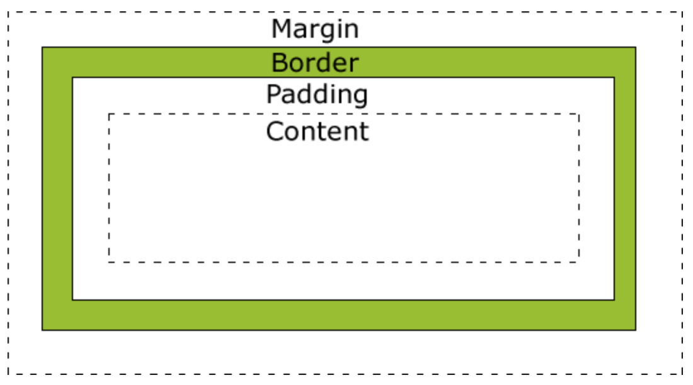

## CSS

### Main

- Every element in web design is a rectangular box

  - Box Model

    

    - width=content-box-width + padding-left + padding-right + border-left + border-right
    - height=content-box-height + padding-top + padding-bottom + border-top + border-bottom

- CSS文档流，即normal-flow

  - 元素按照其在HTML中的位置顺序决定其排布的过程。

  - 只要不是float和绝对定位方式布局的，都在普通流里。

  - 定位

    - static：position默认是static，即未被设置定位的。而只有元素被定位了，它的top，left，right，bottom才会生效。
    - relative：元素会在自身文档流所在位置上被移动，其他的元素则不会调整位置来弥补它偏离后剩下的空隙。
    - absolute：脱离文档流，其他的元素会调整位置来弥补它偏离后剩下的空隙。元素偏移是相对于最近的非static元素的父级定位的。
    - fixed: 生成绝对定位的元素，元素相对的偏移的参考是可视窗口，即使页面滚动，元素仍然会在固定位置。可以做对话框或者悬浮广告。

  - z-index：指定了一个元素及其子元素的 z-order，通常来说 z-index 较大的元素会覆盖较小的一个。仅对定位的元素有效。

  - 脱离文档流

    - `position:absolute`

    - float：让block的元素无视float元素，让inline元素像流水一样围着float元素实现浮动布局。

      - [特性](https://segmentfault.com/a/1190000014554601)

        - 包裹性 - 包裹 和 自适应
        - 高度塌陷： 会让父元素的高度塌陷，可以设置父级容器的`overflow`属性为`auto`,使其自动撑满
        - 块状化：一旦设置float，就会自动具备`display:block`
        - 没有任何margin重叠

      - 使用浮动需要注意的是如果浮动的元素高度比父级容器还高，那么需要设置父级容器的`overflow`属性为`auto`,使其自动撑满。

      - 在非IE浏览器（如Firefox）下，当容器的高度为auto,且容器的内容中有浮动（float为left或right）的元素，在这种情况下，容器的高度不能自动伸长以适应内容的高度，使得内容溢出到容器外面而影响布局的现象，为了防止这个现象的出现而进行的CSS处理，就叫CSS清除浮动。

      - 清除浮动的几种方式

        - div的高度是它里面整个文档流的高度, 元素加上clear：both后，能让它在所有浮动元素的下面。但是需要添加无语义的html元素

          - ```html
            <div class="clear"></div>
            ```

          - ```css
            .clear {
              clear: both;
            }
            ```

        - 相当于在父元素里添加一个子元素（默认内联元素），用来清除容器内的浮动元素。

          - ```css
            .parent::after {
              content: "";
              display: block;  
              clear: both;
            }
            ```

### Reflow vs Repaint

####reference

- https://leohxj.gitbooks.io/front-end-database/content/html-and-css-basic/common-tag.html

### CSS Framework Compartion

#### Styled Component

```shell
npm i --save styled-components
```

```jsx
import React from 'react'
import styled from 'styled-components';

const Button = styled.button `
	color: palevioletred;
	font-size: 1em;
`;

const TomatoButton = styled(Button)`
	color: tomato;
	border-color: tomato;
`;

const Buttons = () => (
  <div>
    <Button>Normal Button</Button>
    <TomatoButton>Tomato Button</TomatoButton>
  </div>
)
```

#### CSS in JS

```shell
npm i --save emotion
```

```jsx
import React from 'react'
import {css} from 'emotion'

const header_height='114px';
const footer_height='114px';

const headerStyles = css({
  '.header': {
		font-size: '10px'    
  }
})
const textStyles = css({
  '.text': {
    width: '440px',
    minHeight: `calc(100vh - ${header_height} - ${footer_height})`
  }
});

const Content = ({value}) => (
	<div className={headerStyles}>
  	<label className={textStyles}>{value}</label>
  </div>
)
```

#### CSS Module

- `:global`: 声明全局规则，不会被编译成hash string

- `compose`: 一个选择器继承另一个选择器的规则

- `postcss-loader & postcss-modules-values`: css modules 支持使用变量

  ```shell
  npm i --save postcss-loader postcss-modules-values
  ```

colors.css

```css
@value blue: #0c77f8;
@value red: #ff0000;
@value green: #aaf200;
```

another.css

```css
.firstname {
  color: yellow;
}
```

App.css

```css
@value colors: "./colors.css";
@value blue, green from colors;

.title {
  font-size: '10px';
  compose: firstname from './another.css'
}

:global(.title) {
  color: green;
}

.content {
  compose: title;
  background-color: blue;
}
```

App.js

```jsx
import React from 'react'
import styles from './App.scss'

const App = () => (
	<h1 className={styles.title}>Using module style</h1>
  <h2 className='title'>Using global style</h2>
)
```

webpack.config.js

```js
module.exports = {
  module: {
    loaders: [
			{
        test: /\.css$/,
        loaders: [
        	'style-loader?sourceMap',
        	'css-loader?modules&localIdentName=[path][name]__[local]--[hash:base64:5]',
          'postcss-loader'
        ]
      }
    ]
  }
}
```

or

```js
module.exports = {
  module: {
    rules: [
      {
        test: /\.css/,
        use: [
          {
            loader: 'style-loader'
          },
          {
            loader: 'css-loader',
            options: { 
              modules: true,
              localIdentName: '[path][name]__[local]--[hash:base64:5]'
            }
          },
          {
            loader: 'postcss-loader'
          }
        ]
      }
    ]
  }
}
```

